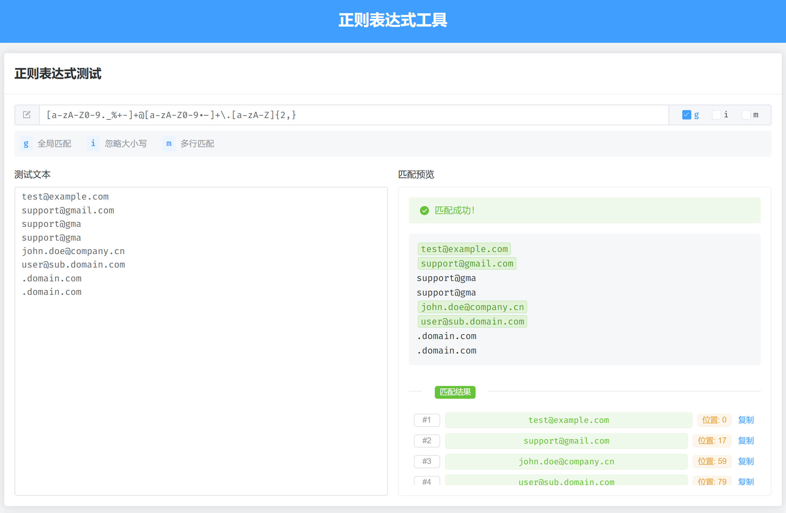
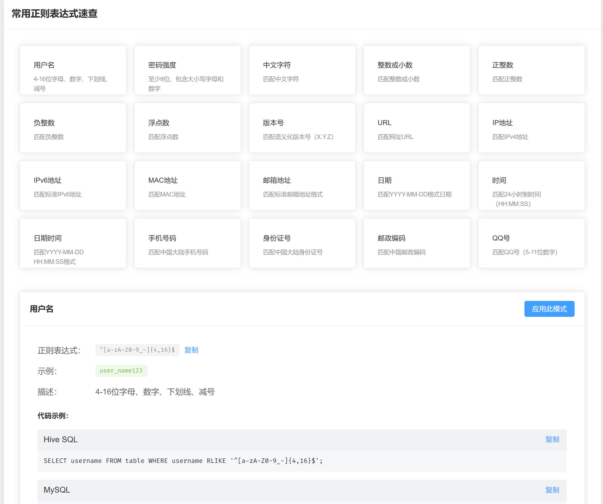

# 正则表达式工具

支持实时测试和常用正则速查，内置 20 个常用正则表达式模板。

## 界面预览




## 功能特点

- 实时测试正则表达式
- 支持 g、i、m 标志位
- 内置 20 个常用正则模板
- 支持多语言代码示例
- 一键复制使用

## 技术栈

Node.js + Vue 3 + Element Plus + Vite

### 开发环境

- Node.js >= 16.0.0
- npm >= 7.0.0

## 快速开始

```bash
# 安装依赖
npm install

# 启动服务
npm run dev

# 打包
npm run build
```

## 使用说明

1. 正则测试：输入正则表达式和测试文本，实时查看匹配结果
2. 正则速查：浏览常用正则表达式，点击查看详情和代码示例

## 开源协议

MIT License
